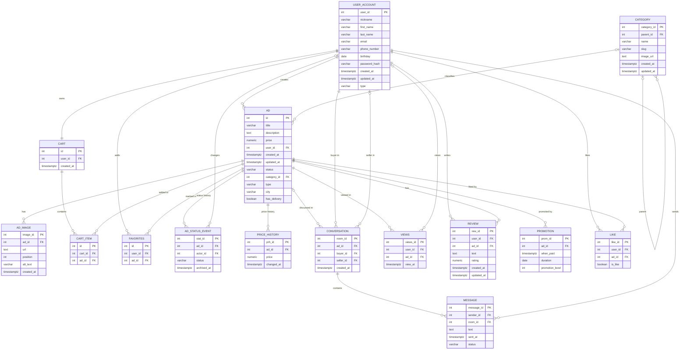

# Схема базы данных Go&Get

ДЗ1 по СУБД: сущности, ER-диаграмма и DDL. Полный SQL со всеми таблицами, индексами, функциями и триггерами лежит в [schema.sql](schema.sql).

На РК1 бэкенд хранит данные в памяти процесса, эта схема будет использоваться с подключением PostgreSQL.

## Сущности

- **USER_ACCOUNT** — продавец или покупатель на платформе.
- **CATEGORY** — категория объявления. Поддерживает иерархию через ссылку на родительскую категорию (`parent_id`).
- **AD** — карточка товара и её данные: категория (`category_id`), город (`city`) и признак возможности доставки (`has_delivery`).
- **AD_IMAGE** — изображение объявления с порядком отображения (`position`).
- **CART** — корзина покупателя.
- **CART_ITEM** — объявление, лежащее в корзине покупателя.
- **FAVORITES** — избранные объявления пользователя.
- **AD_STATUS_EVENT** — история изменения статуса объявления.
- **PRICE_HISTORY** — история изменения цены объявления.
- **CONVERSATION** — комната, где идёт диалог покупателя и продавца.
- **MESSAGE** — сообщение пользователя и его статус.
- **VIEWS** — просмотр объявления.
- **REVIEW** — отзыв пользователя под объявлением.
- **PROMOTION** — вид и срок платного продвижения объявления.
- **LIKE** — одобрение объявления покупателем.

## ER-диаграмма

